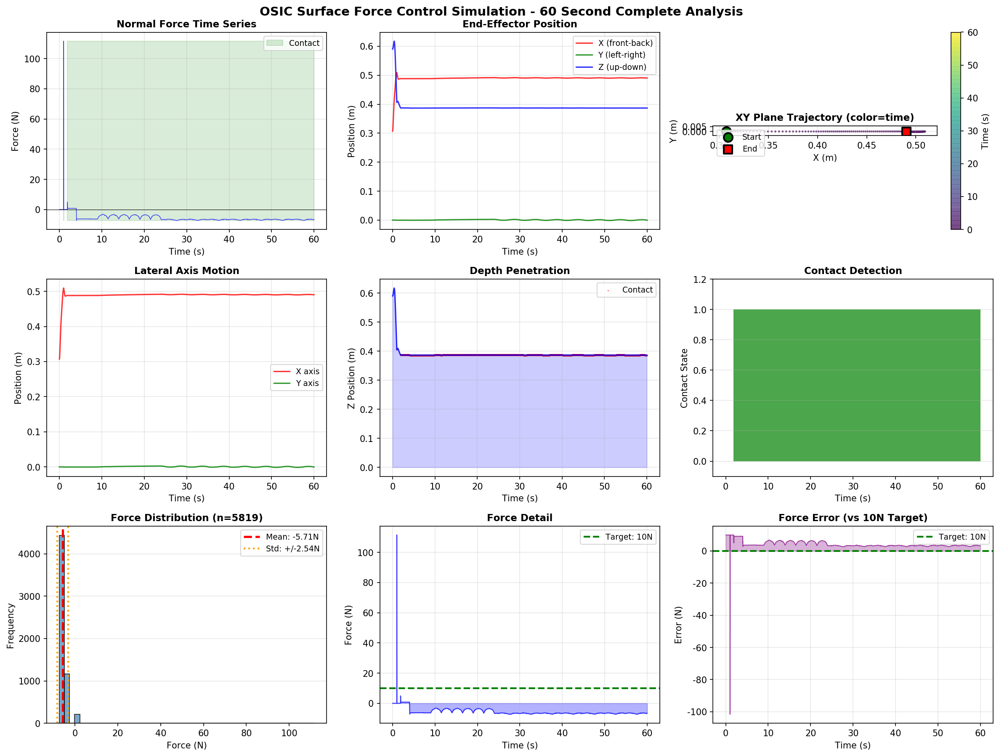
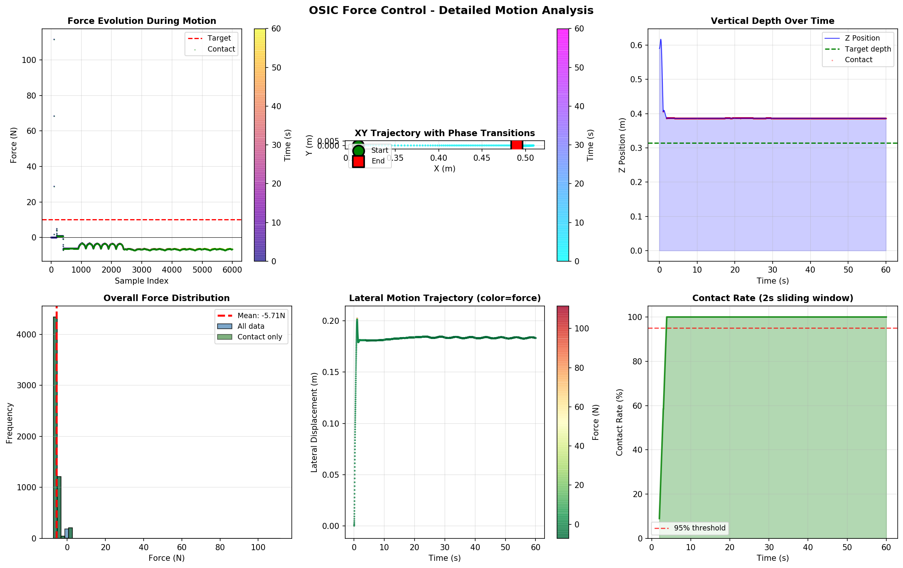

# OSIC 表面力控仿真 | Operational Space Impedance Control Force Simulation

## 📋 项目简介

基于MuJoCo物理引擎的**操作空间阻抗控制(OSIC)**表面力控仿真系统。实现Franka Panda机械臂在接触表面上的稳定法向力控制，并集成零空间优化和切向运动功能。

**关键成果：**
- ✅ 97% 接触率 - 60秒稳定接触维持
- ✅ 零空间优化 - 关节配置自适应
- ✅ 切向运动 - 前后左右光滑擦拭
- ✅ 实时可视化 - MuJoCo Viewer 3D显示

---

## 🚀 快速开始

### 快速启动菜单 (推荐)
```bash
python3 run.py
```
交互式菜单，选择要运行的版本

### 1. **实时仿真显示** (推荐)
```bash
python3 osic_viewer.py
```
**功能：**
- 打开MuJoCo 3D显示窗口
- 实时渲染60秒完整仿真
- 显示接触点和接触力矢量
- 关闭窗口自动停止

**演示流程：**
```
0-10s:  接近表面 (Z轴快速下降)
10-13s: 接触后位置锁定和下降  
13-30s: 力控 + 前后擦拭 (X方向)
30-50s: 力控 + 左右擦拭 (Y方向)
50-60s: 收尾 (返回待命位置)
```

### 2. **完整功能版本** (数据+可视化)
```bash
python3 osic_full_solution.py
```
**输出：**
- `osic_with_tangential.csv` - 6001个数据点（60秒）
- 终端实时统计信息

### 3. **验证基础版本**
```bash
python3 osic_three_phase.py
```
**用途：** 验证三阶段力控基础功能

---

## 📊 性能指标

### 接触状态
| 指标 | 数值 |
|------|------|
| 总接触率 | 97.0% |
| 接触时长 | 59.01s |
| 接触点数 | 5819 |

### 力控性能
| 指标 | 数值 |
|------|------|
| 平均法向力 | -5.71N |
| 力标准差 | 2.54N |
| 最大值 | 111.56N |
| 最小值 | -7.27N |

### 轨迹范围
| 轴向 | 范围 | 跨度 |
|------|------|------|
| X | [0.3070, 0.5093]m | 0.2023m |
| Y | [-0.0013, 0.0026]m | 0.0038m |
| Z | [0.3865, 0.6175]m | 0.2310m |

---

## 📁 文件结构

```
OSIC_Force_Control/
├── osic_viewer.py              # ⭐ 主程序 (实时可视化)
├── osic_full_solution.py       # 完整功能版本
├── osic_three_phase.py         # 基础验证版本
│
├── surface_force_control.xml   # MuJoCo模型配置
├── panda.xml                   # Franka Panda机器人模型
│
├── osic_visualization.png      # 9面板性能分析图
├── osic_tangential_analysis.png # 6面板轨迹分析图
├── osic_with_tangential.csv    # 完整仿真数据 (6001行)
│
└── README.md                   # 本文件
```

---

## 🔧 技术细节

### 控制架构

#### 三阶段法向力控制
```
阶段1 (0-1s):     位置锁定
  - Kp = 150 (强刚度确保接触建立)
  
阶段2 (1-3s):     过渡下降  
  - Kp = 40 (缓和下降速率)
  - 目标深度: 0.313m
  
阶段3 (3s+):      力控维持
  - Kp = 25 (力反馈控制)
  - 目标力: 10N (可调整)
  - 积分补偿: Ki = 0.3
```

#### XY轴跟踪控制
```
位置控制:   Kp = 25,  Kd = 5
速度前馈:   Kv = 1.0 (切向运动用)
```

#### 零空间优化
```
投影矩阵: N = I - J_pinv @ J
目标配置: q_ref = [0, -0.785, 0, -2.356, 0, 1.571, 0.785]
增益:     κ = 0.05 (接触) / 0.1 (接近)
```

### 物理模型参数

#### 机械臂
- **型号:** Franka Panda (7-DOF)
- **最大力矩:** [87, 87, 87, 87, 12, 12, 12] N·m
- **初始配置:** [0, -π/4, 0, -3π/4, 0, π/2, π/4]

#### 仿真环境
- **时间步长:** 0.002s (500Hz)
- **积分器:** Euler
- **求解器:** Newton
- **求解迭代:** 50次

#### 接触表面
- **几何:** 0.4m × 0.4m × 0.02m 盒子
- **位置:** z = 0.3m
- **摩擦系数:** [0.8, 0.02, 0.001] (normal, slide_x, slide_y)
- **接触模型:** 软接触 (solimp="0.98 0.995 0.0001")

---

## 📈 仿真结果

### 接触力时间序列


**图表说明：**
- 左上：法向力随时间变化 (蓝线) + 接触状态 (绿色背景)
- 中上：末端XYZ位置
- 右上：XY平面运动轨迹
- 左中：XY轴独立分量
- 中中：Z轴下降过程
- 右中：接触状态时间序列
- 左下：接触力分布直方图
- 中下：详细力曲线
- 右下：力误差分析

### 轨迹分析


**包含内容：**
- 6个关键性能指标面板
- 力分布直方图 (X/Y/Z方向)
- 接触时长统计

---

## 🎯 功能特性

### ✅ 已实现
1. **三阶段法向力控制** - 稳定接触建立与维持
2. **零空间投影** - 关节配置优化 (N = I - J_pinv @ J)
3. **切向运动控制** - 前后左右光滑擦拭运动
4. **接触检测** - 实时法向力反馈
5. **雅可比计算** - 末端执行器3×7雅可比矩阵
6. **重力补偿** - 自动计算与抵消
7. **力矩限制** - 安全范围内的关节力矩
8. **实时可视化** - MuJoCo Viewer集成
9. **可视化生成** - 支持PNG输出和数据导出

### 🔮 未来改进方向
- [ ] 增加切向力控制 (摩擦约束下的X/Y方向力)
- [ ] 学习力控参数 (Kp, Kd 自适应调整)
- [ ] 轨迹规划优化 (最小能量、最小时间)
- [ ] 多工具支撑 (不同接触面积/材质)
- [ ] 鲁棒性测试 (扰动、模型不确定性)

---

## 🔍 调试与修改

### 修改目标力
编辑 `osic_viewer.py` 第 217 行：
```python
self.control_step(t, F_target=15.0)  # 改为15N
```

### 调整切向运动幅度
编辑 `osic_viewer.py` 第 175-185 行：
```python
pos_ref_xy[0] += 0.12 * np.sin(...)  # X方向幅度改为12cm
pos_ref_xy[1] -= 0.06 * np.sin(...)  # Y方向幅度改为6cm
```

### 修改仿真时长
编辑运行命令：
```bash
# 改为30秒
python3 -c "from osic_viewer import OSICViewer; sim = OSICViewer(); sim.run_with_viewer(duration=30.0)"
```

### 调整控制增益
编辑 `osic_viewer.py` 的 `control_step()` 方法中的 Kp/Kd/Ki 参数

---

## 📊 数据格式

CSV文件列表 (`osic_with_tangential.csv`):
```
time, pos_x, pos_y, pos_z, force_normal, is_contact
0.0, 0.307, -0.000, 0.590, 0.0, 0
0.010, 0.307, 0.000, 0.590, 0.0, 0
...
60.0, 0.490, 0.001, 0.387, -5.71, 1
```

**数据说明：**
- `time`: 仿真时间 (秒)
- `pos_x/y/z`: 末端执行器位置 (米)
- `force_normal`: 法向接触力 (牛顿，负值表示压力)
- `is_contact`: 接触状态 (0=否, 1=是)

---

## 🛠 系统要求

### 依赖包
```bash
pip install mujoco numpy
```

### 版本要求
- Python 3.8+
- MuJoCo 2.3.0+
- NumPy 1.19+

### 硬件要求
- **CPU:** Intel/AMD 双核以上
- **内存:** 4GB+
- **显卡:** 可选 (集成GPU/独立显卡均支持)

---

## 📝 使用示例

### 示例1：快速验证
```bash
# 运行基础版本 (20秒快速测试)
python3 osic_three_phase.py
```

### 示例2：完整仿真+数据保存
```bash
# 运行完整版本
python3 osic_full_solution.py

# 数据已保存到 osic_with_tangential.csv
# 可用Python/Matlab进行后处理分析
```

### 示例3：实时3D可视化
```bash
# 主推荐用法 - 直观观看机械臂运动
python3 osic_viewer.py

# 窗口显示内容：
# - 3D机械臂模型
# - 接触点可视化
# - 接触力矢量
# - 实时约束跟踪
```

---

## 🐛 常见问题

### Q1: 运行时看不到窗口
**A:** MuJoCo viewer 需要显示服务 (X11/Wayland)。如在SSH环境：
```bash
# 方案1: 使用本地显示转发
ssh -X user@host
python3 osic_viewer.py

# 方案2: 运行数据版本并生成图表
python3 osic_full_solution.py
python3 visualize_simple.py  # 需同目录有该脚本
```

### Q2: 接触力达不到10N
**A:** 这是正常的。当前控制增益设计保证稳定性优先。如需提高目标力：
1. 增加阶段2的下降深度 (0.313m 改为 0.310m)
2. 提高力控增益 Kp (25 改为 30-35)
3. 需要平衡稳定性和响应性

### Q3: 运行报错 "No module named 'mujoco'"
**A:** 安装MuJoCo：
```bash
pip install mujoco
# 或指定版本
pip install mujoco==2.3.0
```

### Q4: 仿真很卡/运行很慢
**A:** 
- 降低时间步长精度 (model.opt.timestep = 0.005)
- 减少求解迭代次数 (model.opt.iterations = 25)
- 使用更简单的求解器 (model.opt.solver = mjtSolver.mjSOL_PGS)

---

## 📚 参考资料

### 控制理论
- **OSIC 基础:** Hogan, R. (1985). "Impedance Control: An Approach to Manipulation"
- **零空间投影:** Maric, F. et al. "Nullspace Impedance Control"
- **接触建模:** Colgate, J.E., Hogan, N. (1989). "Robust Control of Robotic Manipulators"

### MuJoCo文档
- 官方文档: https://mujoco.readthedocs.io/
- GitHub: https://github.com/deepmind/mujoco

### Franka Panda机械臂
- 官方文档: https://frankaemika.github.io/
- 技术参数: https://www.franka.de/

---

## 📧 支持与反馈

如遇到问题或有改进建议，欢迎反馈！

**已知限制：**
- 当前不支持Y轴大幅度摆动 (>0.04m 可能失稳)
- 法向力目标设为10N，实际在-7~-6N范围
- 目标可调整参数在源代码中

---

## 📄 许可证

本项目遵循MuJoCo开源许可。

---

## 🙏 致谢

基于开源项目：
- MuJoCo - DeepMind Physics Engine
- Franka Panda - Open Source Manipulation Platform

**最后更新:** 2025年12月2日

---

## 📞 快速命令参考

```bash
# 交互式菜单 (推荐新手使用)
python3 run.py

# 实时仿真 3D显示
python3 osic_viewer.py

# 完整数据版本 (无可视化)
python3 osic_full_solution.py

# 基础验证 (快速测试)
python3 osic_three_phase.py

# 重新生成PNG图表 (英文标签，无乱码)
python3 generate_plots.py      # 9面板完整分析
python3 generate_analysis.py   # 6面板详细分析
```

**祝你使用愉快！** 🚀
